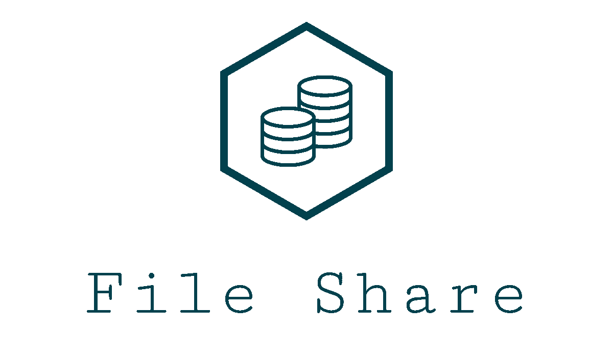

[hugo]: https://github.com/HugoCarvalho99
[hugo-pic]: https://github.com/HugoCarvalho99.png?size=120
[nelson]: https://github.com/nelsonmestevao
[nelson-pic]: https://github.com/nelsonmestevao.png?size=120
[pedro]: https://github.com/pedroribeiro22
[pedro-pic]: https://github.com/pedroribeiro22.png?size=120
[rui]: https://github.com/ruimendes29
[rui-pic]: https://github.com/ruimendes29.png?size=120

<div align="center">
    
</div>

> A distributed file sharing system

## :rocket: Getting Started

Start by copying the `.env.sample` into `.env` and fill in the fields correctly.

```bash
cp .env.sample .env
```

This project uses settings configured in environment variables defined in the
`.env` file. In order to get those properly exported is recommend to set up
[direnv](https://direnv.net/) for a terminal based work flow and the plugin
[EnvFile](https://github.com/Ashald/EnvFile) for IntelliJ.

### :hammer: Development

Compile the project in a clean build.

```
mvn clean compile
```

Start the server.

```
mvn exec:java@server
```

Start a client.

```
mvn exec:java@client
```

Running tests.

```
mvn test
```

Format the code accordingly to common guide lines.

```
mvn formatter:format
```

Lint your code with _checkstyle_.

```
mvn checkstyle:check
```

### :package: Deployment

Bundling the app into jar file.

```
mvn package
```

### :hammer_and_wrench: Tools

The recommended Integrated Development Environment (IDE) is IntelliJ IDEA.

## Description

As  plataformas  de  troca  de  ficheiros  como  o  SoundCloud  permitem  que
músicos  partilhem  as  suas criações diretamente com os seus fãs. Para o
efeito, podem carregar ficheiros de música acompanhados de meta-informação
variada (título, autor, interprete, género, ...). A meta-informação serve para
que os ouvintes tomem conhecimento dos ficheiros partilhados e possam efetuar
pesquisas. Tendo encontrado os ficheiros desejados, podem então descarregá-los
para uso posterior. Tendo em conta que os ficheiros a serem trocados são de
dimensão considerável, normalmente com vários MB, a concretização destes sistemas
tem que prestar particular atenção aos recursos consumidos com o armazenamento,
manipulação e transmissão destes ficheiros. Em particular, é importante a
limitação do número de operações simultâneas que podem ser efetuadas para não
sobrecarregar o sistema e a manutenção de uma justiça relativa entre os
diferentes utilizadores. Neste projeto pede-se a implementação de uma plataforma
para partilha de ficheiros de música soba forma de cliente/servidor em Java
utilizando _sockets_ e _threads_.

### Basic Functionality

Este serviço deverá suportar a seguinte funcionalidade básica:

* Autenticação e registo de utilizador, dado o seu nome e palavra-passe. Sempre
  que um utilizador desejar interagir com o serviço deverá estabelecer uma
  conexão e ser autenticado pelo servidor.
* Publicar um ficheiro de música, fornecendo o seu conteúdo e alguns meta-dados
  (título, intérprete, ano e um número variável de etiquetas) e recebendo um
  identificador único.
* Efetuar uma procura de música, enviando uma etiqueta a procurar e recebendo de
  volta uma lista das músicas que lhe correspondem. Para cada música devem ser
  também recebidos os seguintes seus meta-dados:
    1. identificador único;
    2. título, intérprete, ano e um número variável de etiquetas, fornecidos
       quando a música é carregada;
    3. número de vezes que a música foi descarregada.
* Descarregar um ficheiro de música, fornecendo o seu identificador único.

### Extra Functionality

#### Limite de descargas:

* O servidor deve garantir que em cada momento não há mais do que MAXDOWN
  descargas de ficheiros a ocorrer em simultâneo.
* Pedidos de descarga que ultrapassem o limite devem esperar até obterem vez.
* Em caso de espera, deve ser estabelecida uma política que combine a ordem de
  chegada com a necessidade de todos os utilizadores obterem ficheiros.

#### Notificação de novas músicas:

* Durante o período em que um cliente está ligado ao servidor, deve receber
  notificações de novas músicas que sejam carregadas.
* Cada notificação deve conter o título e autor da música.
* Deve ser possível continuar a receber e mostrar notificações mesmo durante
  outras operações demoradas de carga ou descarga de ficheiros.

### Tamanho dos ficheiros ilimitado:

* A solução apresentada não deve assumir que cada ficheiro de música cabe
  completamente em memória.
* Pelo contrário, deve garantir que a transferência de cada ficheiro nunca ocupa
  mais do que MAXSIZE bytes em memória, tanto do cliente como do servidor.

### Client

Deverá ser disponibilizado um cliente que ofereça uma interface com o utilizador
que permita suportar a funcionalidade descrita acima. Este cliente deverá ser
escrito em Java usando _threads_ e _sockets_ TCP.

### Server

O servidor deverá ser escrito também em Java, usando _threads_ e _sockets_ TCP,
mantendo em memória a informação relevante para suportar as funcionalidades
acima descritas (exceto o conteúdo dos próprios ficheiros), receber conexões e
input dos clientes, bem como fazer chegar a estes a informação pretendida.  O
protocolo entre cliente e servidor deverá ser baseado em texto, orientado à
linha (exceto o conteúdo dos próprios ficheiros). Para o servidor não ficar
vulnerável a clientes lentos, cada _thread_ não deverá escrever em mais do que
um socket.

## :busts_in_silhouette: Team

[![Hugo][hugo-pic]][hugo] | [![Nelson][nelson-pic]][nelson] | [![Pedro][pedro-pic]][pedro] | [![Rui][rui-pic]][rui]
:---: | :---: | :---: | :---:
[Hugo Carvalho][hugo] | [Nelson Estevão][nelson] | [Pedro Ribeiro][pedro] | [Rui Mendes][rui]

